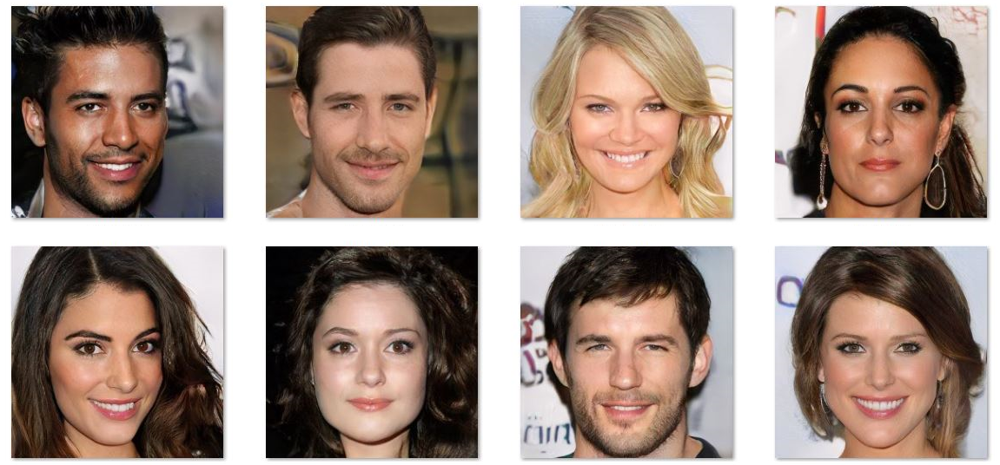
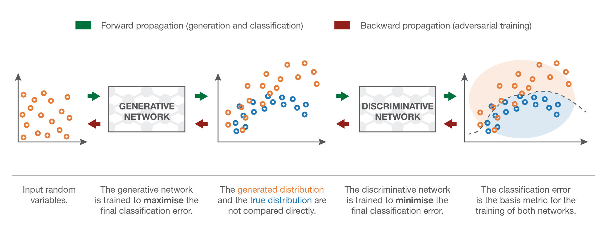
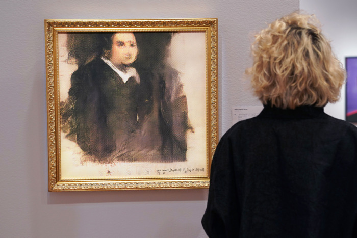

# Generative Adversarial Networks
## Short Reading
### Overview
Generative adversarial networks (GANs) are probably one of the most interesting architectures to have come out of machine learning. Instead of having neural networks that simply extract information out of data to infer patterns for generalization, two neural networks essentially battle (they're adversarial) each other ~for supremacy~ to generate/produce new data that are very believable.


<sub> All the above faces are fake and generated from a GAN. These people do not exist. </sub>

One of the two neural networks is the *generator*, which generates new information original data. Its goal is to be able to train to be good at making something similar to the original data, and more specifically, *maximize the classification error* between true and its own generated data when passed into the discriminator.

The original data as well as *generator* generated data is fed into what is called a *discriminator*, whose goal is to identify which images is real and which image is the fake generated image, and more specifically, *minimize the final classification error*.

Ideally, as the GAN trains...
- The generator starts making data that are very identical to the original data in the training dataset, with minimal flaws, that it becomes difficult to tell whether the data is generated (fake) or real.
- The discriminator becomes so good at noticing flaws within the generator-generated data that it starts learning what exactly is true data in comparison to generated (fake) data.

From the above, ideally the generator will have to train further to minimize its flaws so that the images become more dataset-like and fool the discriminator, and the discriminator has to find flaws so that it doesn't get fooled by the generator.

In summary, they essentially "fight" each other with "opposing" goals which end up making for better forms of themselves.




### Example generations of GANs
As you have seen from the fake faces above, GANs have incredible capability to create very realistic fake data. As such, they have multiple applications most especially in ones that require the creation of something new, like art.

#### 1.

My first example is from "High-Resolution Image Synthesis and Semantic Manipulation with Conditional GANs." As you can see by (a), (b), and (c) below, none of these images are real but instead generated by a GAN. They're given shapes that represent labels similar to what you see in the bottom left corner of (a):
- Blue shapes that represent cars
- Pale purple shapes that represents the road
- Magenta shapes that represents the sidewalk
- Green shapes that represents trees
- etc.

And the GAN just "colors" these shapes into the labels that they represent like the prodigy 3-year-old toddler that it is.


You can find more information about this in [this paper](https://arxiv.org/pdf/1711.11585.pdf).

#### 2.

Second up: art that sold for $400,000. It looks terrible. Not going to explain it further, but it does pose an interesting question: can AI finally start replicating "creativity?"



You can find more information about this in [this article](https://www.vulture.com/2018/10/an-artificial-intelligence-artwork-just-sold-for-usd400-000.html).

#### 3.

In case you lost hope with neural networks being able to do super-resolution from the last homework, GANs are currently the preferred method for generating super-resolution images. For your reference, bicubic resizing is the algorithm you'd normally find in typical image editors like GIMP or Adobe Photoshop. What you see here is 4x upscaling, and SRGAN is the proposed GAN method :


You can find more information about this in [this paper](https://arxiv.org/pdf/1609.04802.pdf).


### GAN Deeper Dive
If you'd like to know more about GANs in a deeper level, this is a good resource that is not incredibly difficult to read that walks you through the thought process of the inception of GANs.

https://towardsdatascience.com/understanding-generative-adversarial-networks-gans-cd6e4651a29

## GAN Tutorial

This is a simpler version found [here](www.google.com). As usual, the code was written in a way that's quite different to what we have normally covered, so I've simplified it a little bit and will be walking through it.

Here are the libraries that we are importing. As you can see, we're using MNIST. Not only that, but we're making a generative adversarial network based on multi-layer perceptrons as you can see by the use of the ```Dense``` layer. Lastly, we will be adding normalization into the neural network through ```BatchNormalization```, which was talked about in assignment 3.

```py
from tensorflow.keras.datasets import mnist
from tensorflow.keras.layers import Input, Dense, Reshape, Flatten, \
    BatchNormalization, LeakyReLU
from tensorflow.keras.models import Sequential, Model
import numpy as np
import matplotlib.pyplot as plt
```

```py
# Generator
generator = Sequential()
generator.add(Dense(256, input_dim=100))
generator.add(LeakyReLU(alpha=0.2))
generator.add(BatchNormalization(momentum=0.8))
generator.add(Dense(512))
generator.add(LeakyReLU(alpha=0.2))
generator.add(BatchNormalization(momentum=0.8))
generator.add(Dense(1024))
generator.add(LeakyReLU(alpha=0.2))
generator.add(BatchNormalization(momentum=0.8))
generator.add(Dense(np.prod((28, 28, 1)), activation='tanh'))
generator.add(Reshape((28, 28, 1)))
g_noise = Input(shape=(100,))
g_img = generator(g_noise)

# Discriminator
discriminator = Sequential()
discriminator.add(Flatten(input_shape=(28, 28, 1)))
discriminator.add(Dense(512))
discriminator.add(LeakyReLU(alpha=0.2))
discriminator.add(Dense(256))
discriminator.add(LeakyReLU(alpha=0.2))
discriminator.add(Dense(1, activation='sigmoid'))
discriminator.summary()
d_img = Input(shape=(28, 28, 1))

discriminator.compile(loss='binary_crossentropy',
                           optimizer='adam',
                           metrics=['accuracy'])

# Load the dataset
(X_train, _), (_, _) = mnist.load_data()

# Rescale -1 to 1
X_train = X_train / 127.5 - 1.
X_train = np.expand_dims(X_train, axis=3)

# Adversarial ground truths
valid = np.ones((16, 1))
fake = np.zeros((16, 1))

z = Input(shape=(100,))
img = generator(z)
discriminator.trainable = False

validity = discriminator(img)

combined = Model(z, validity)
combined.compile(loss='binary_crossentropy', optimizer='adam')

for epoch in range(10000):
    idx = np.random.randint(0, X_train.shape[0], 16)
    imgs = X_train[idx]

    noise = np.random.normal(0, 1, (16, 100))

    gen_imgs = generator.predict(noise)

    d_loss_real = discriminator.train_on_batch(imgs, valid)
    d_loss_fake = discriminator.train_on_batch(gen_imgs, fake)
    d_loss = 0.5 * np.add(d_loss_real, d_loss_fake)
    d_acc = round(float(d_loss[1]), 4)
    d_loss = round(float(d_loss[0]), 4)

    noise = np.random.normal(0, 1, (16, 100))
    g_loss = round(float(combined.train_on_batch(noise, valid)), 4)

    comb_str = "Epoch {:.5s}: {:.40s} | {} ".format(f"{epoch}{' ' * 100}",
                                                    f"Disciminator - Loss: {d_loss}, Acc: {d_acc} {' ' * 100}",
                                                    f"Generator - Loss: {g_loss}")
    print(comb_str)

    if epoch % 200 == 0:
        r, c = 5, 5
        noise = np.random.normal(0, 1, (r * c, 100))
        gen_imgs = generator.predict(noise)

        gen_imgs = 0.5 * gen_imgs + 0.5

        fig, axs = plt.subplots(r, c)
        cnt = 0
        for i in range(r):
            for j in range(c):
                axs[i, j].imshow(gen_imgs[cnt, :, :, 0], cmap='gray')
                axs[i, j].axis('off')
                cnt += 1
        fig.savefig("images/%d.png" % epoch)
        plt.close()
```
