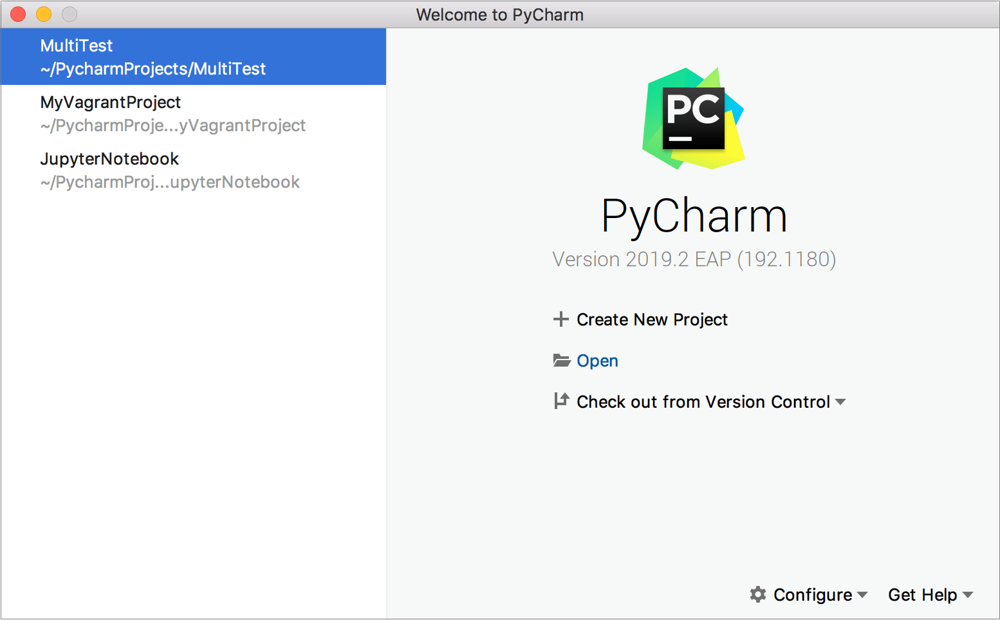

## Setting up PyCharm to work with an Anaconda environment
### Start here:
You will need to find out where your environment's Python interpreter is installed. In order to do this, follow these steps
(this is assuming you are running Windows)

1. Open an Anaconda Prompt (**not** an Anaconda Powershell Prompt -- for whatever reason it doesn't work in the Powershell version).
  - You can determine which prompt you're using through the title bar of your command line window, it will say either "Anaconda Prompt" or "Anaconda Powershell Prompt". If it says "Anaconda Prompt," proceed to step 2.
2. Determine if you made an environment or not when following the setup guide:
  - If you did not make an environment, skip to step 3.
  - If you did make an environment, type ```conda activate <your_environment_name>```. For this class, it is most likely ```conda activate IntroML```.
3. Type ```where python```. It should give you a list of paths. The path with ```\env\``` is the one you want. In the screenshot below, you can see that this is ```C:\Users\dakil\Anaconda3\envs\IntroML\python.exe```


4. Copy this path. You will need to so that PyCharm knows which interpreter to use.

5. Do you already have a PyCharm project created?
  - If you do not have a PyCharm project created, follow this link: [Create PyCharm project to work with Anaconda](#connect-pycharm-to-anaconda-from-scratch)
  - If you do have a PyCharm project created, follow this link: [Configure PyCharm project to use an Anaconda environment](#configure-pycharm-project-to-use-an-anaconda-environment)

### Connect PyCharm to Anaconda from scratch
1. Create a PyCharm project. If this is your first time setup, you should see a button to "Create a project"



2.


### Configure PyCharm project to use an Anaconda environment
